# COA读书摘要

标注约定

定义:绿色

一般重要:黄色

106页以后才想起来

翻译:灰色

橙色：问题解答

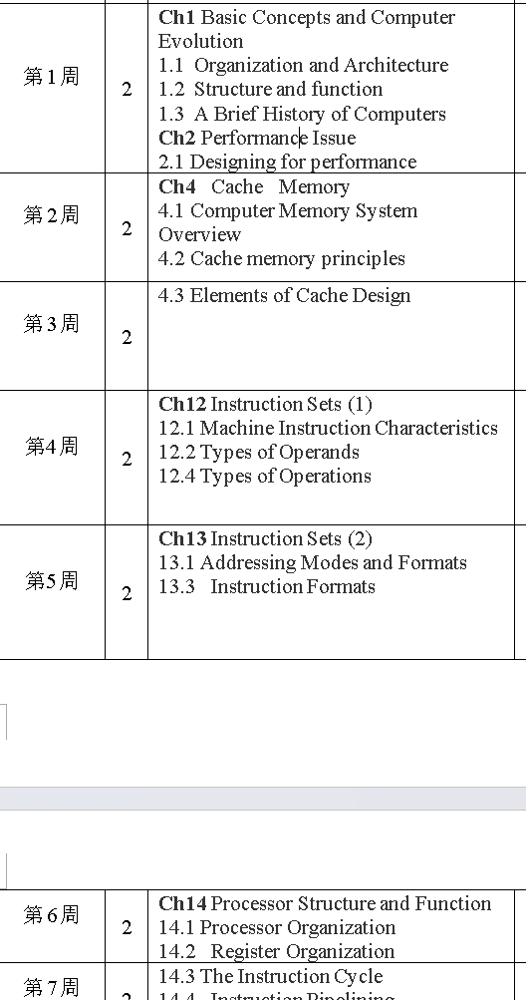

[图解直接映射（Direct mapped）、全相联（Fully-associative）和组相联（Set-associative）cache缓存基本原理\_直接映射全相联映射组相联映射-CSDN博客](https://blog.csdn.net/luolaihua2018/article/details/132647066)

前索引和后索引preindexing and postindexing

**Pre-indexed**

The offset is combined with the value in the base register, and the base register is updated with this new address *before* being used to access memory.

寄存器在其内容被使用前就被更新

**Post-indexed**

The value in the base register alone is used to access memory. Then the the offset is combined with the value in the base register, and the base register is updated with this new address *after* accessing memory.

寄存器在其内容被使用后被更新

网络资料上的两种索引方式都是针对自增而言的

但是本书对前索引和后索引的理解好像不一样，本书的两种索引方式是针对间接寻址与变址寻址的相对位置来定义这两种索引方式的。

<a href="zotero://open-pdf/library/items/5WXAJZDU?page=487">“In some machines, both indirect addressing and indexing are provided, and it is possible to employ both in the same instruction. There are two possibilities: the indexing is performed either before or after the indirection.”</a> (<a href="zotero://select/library/items/VEKBRPPP">“Computer Organization and Architecture Designing for Performance.pdf”, p. 462</a>)

后索引指的是先间接寻址再变址寻址：

address field中的内容先用来间接寻址，再加上寄存器的内容，其和作为EA

前索引指的是先变址寻址再间接寻址：address field中的内容先加上寄存器的内容，其和再做间接寻址，结果作为EA

12.6

<a href="zotero://open-pdf/library/items/5WXAJZDU?page=442">“Figure 12.3 compares typical one-, two-, and three-address instructions that could be used to compute Y = (A - B)/[C + (D * E)].”</a> (<a href="zotero://select/library/items/VEKBRPPP">“Computer Organization and Architecture Designing for Performance.pdf”, p. 417</a>)

<a href="zotero://open-pdf/library/items/5WXAJZDU?page=27">“<strong>Computer architecture</strong> refers to those attributes of a system visible to a programmer or, put another way, those attributes that have a direct impact on the logical execution of a program.”</a>

“The **instruction set architecture(ISA)** defines instruction formats, instruction opcodes, registers, instruction and data memory; the effect of executed instructions on the registers and memory; and an algorithm for controlling instruction execution.”

<a href="zotero://open-pdf/library/items/5WXAJZDU?page=27">“<strong>Computer organization</strong> refers to the operational units and their interconnections that realize the architectural specifications.”</a>

<a href="zotero://open-pdf/library/items/5WXAJZDU?page=27">“<strong>architectural attributes</strong> include the instruction set, the number of bits used to represent various data types (e.g., numbers, characters), I/O mechanisms, and techniques for addressing memory.”</a>

<a href="zotero://open-pdf/library/items/5WXAJZDU?page=27">“<strong>Organizational attributes</strong> include those hardware details transparent to the programmer, such as control signals; interfaces between the computer and peripherals; and the memory technology used.”</a>

<a href="zotero://open-pdf/library/items/5WXAJZDU?page=28">“A <strong>hierarchical system</strong> is a set of interrelated subsystems, each of the latter, in turn, hierarchical in structure until we reach some lowest level of elementary subsystem.”</a>

<a href="zotero://open-pdf/library/items/5WXAJZDU?page=28&#x26;annotation=59XHP4NZ">“The hierarchical nature of complex systems is essential to both their design and their description.”</a>

“**Structure**: The way in which the components are interrelated.

**Function**: The operation of each individual component as part of the structure.”

<a href="zotero://open-pdf/library/items/5WXAJZDU?page=28&#x26;annotation=AINA8R7R">“In terms of description, we have two choices: starting at the bottom and building up to a complete description, or beginning with a top view and decomposing the system into its subparts. Evidence from a number of fields suggests that the topdown approach is the clearest and most effective”</a>

In general terms, there are only **four basic functions that a computer can perform**:

data processing

data storage

data movement

control

<a href="zotero://open-pdf/library/items/5WXAJZDU?page=29&#x26;annotation=VLA28NCP">“When data are received from or delivered to a device that is directly connected to the computer, the process is known as <strong>input–output (I/O)</strong>, and the device is referred to as a <strong>peripheral</strong>.When data are moved over longer distances, to or from a remote device, the process is known as <strong>data communications</strong>”</a>

(traditional single-processor computer)<a href="zotero://open-pdf/library/items/5WXAJZDU?page=29">“There are four main structural components:”</a>

<a href="zotero://open-pdf/library/items/5WXAJZDU?page=29">“<strong>Central processing unit (CPU)</strong>: Controls the operation of the computer and performs its data processing functions; often simply referred to as processor.”</a>

<a href="zotero://open-pdf/library/items/5WXAJZDU?page=29&#x26;annotation=PQ92Y2FE">“<strong>Main memory</strong>: Stores data.”</a>

<a href="zotero://open-pdf/library/items/5WXAJZDU?page=30">“<strong>I/O</strong>: Moves data between the computer and its external environment.”</a>

<a href="zotero://open-pdf/library/items/5WXAJZDU?page=30">“<strong>System interconnection</strong>: Some mechanism that provides for communication among CPU, main memory, and I/O. A common example of system interconnection is by means of a system bus, consisting of a number of conducting wires to which all the other components attach.”</a>

CPU’s major structural components are as follows:

■ **Control unit**: Controls the operation of the CPU and hence the computer.

■ **Arithmetic and logic unit (ALU)**: Performs the computer’s data processing functions.

■ **Registers**: Provides storage internal to the CPU.

■ **CPU interconnection**: Some mechanism that provides for communication among the control unit, ALU, and registers.

“When these processors all reside on a single chip, the term multicore computer is used, and each processing unit (consisting of a control unit, ALU, registers, and perhaps cache) is called a core. To clarify the terminology, this text will use the following definitions. ■ **Central processing unit (CPU)**: That portion of a computer that fetches and executes instructions. It consists of an ALU, a control unit, and registers. In a system with a single processing unit, it is often simply referred to as a processor.

■ **Core**: An individual processing unit on a processor chip. A core may be equivalent in functionality to a CPU on a single-CPU system. Other specialized processing units, such as one optimized for vector and matrix operations, are also referred to as cores.

■ **Processor**: A physical piece of silicon containing one or more cores. The processor is the computer component that interprets and executes instructions. If a processor contains multiple cores, it is referred to as a multicore processor.”

<a href="zotero://open-pdf/library/items/5WXAJZDU?page=31&#x26;annotation=KSTACIN3">“Another prominent feature of contemporary computers is the use of multiple layers of memory, called cache memory, between the processor and main memory.”</a>

<a href="zotero://open-pdf/library/items/5WXAJZDU?page=32">“A <strong>printed circuit board (PCB)</strong> is a rigid, flat board that holds and interconnects chips and other electronic components.”</a>

“In general terms, the functional elements of a core are: ■ **Instruction logic**: This includes the tasks involved in fetching instructions, and decoding each instruction to determine the instruction operation and the memory locations of any operands.

■ **Arithmetic and logic unit (ALU)**: Performs the operation specified by an instruction.

■ **Load/store logic**: Manages the transfer of data to and from main memory via cache.”

<a href="zotero://open-pdf/library/items/5WXAJZDU?page=33">“L1 cache, split between an <strong>instruction cache</strong> (I-cache) that is used for the transfer of instructions to and from main memory, and an <strong>L1 data cache</strong>, for the transfer of operands and results.”</a>

sub-areas within a specific core area:

“■ ISU (instruction sequence unit): Determines the sequence in which instructions are executed in what is referred to as a superscalar architecture (Chapter 16).

■ IFU (instruction fetch unit): Logic for fetching instructions.” (<a href="zotero://select/library/items/VEKBRPPP">“Computer Organization and Architecture Designing for Performance.pdf”, p. 9</a>)

“■ IDU (instruction decode unit): The IDU is fed from the IFU buffers, and is responsible for the parsing and decoding of all z/Architecture operation codes.

■ LSU (load-store unit): The LSU contains the 96-kB L1 data cache,1 and manages data traffic between the L2 data cache and the functional execution units. It is responsible for handling all types of operand accesses of all lengths, modes, and formats as defined in the z/Architecture.

■ XU (translation unit): This unit translates logical addresses from instructions into physical addresses in main memory. The XU also contains a translation lookaside buffer (TLB) used to speed up memory access. TLBs are discussed in Chapter 8.

■ FXU (fixed-point unit): The FXU executes fixed-point arithmetic operations.

■ BFU (binary floating-point unit): The BFU handles all binary and hexadecimal floating-point operations, as well as fixed-point multiplication operations.

■ DFU (decimal floating-point unit): The DFU handles both fixed-point and floating-point operations on numbers that are stored as decimal digits.

■ RU (recovery unit): The RU keeps a copy of the complete state of the system that includes all registers,”

“■ COP (dedicated co-processor): The COP is responsible for data compression and encryption functions for each core.

■ I-cache: This is a 64-kB L1 instruction cache, allowing the IFU to prefetch instructions before they are needed.

■ L2 control: This is the control logic that manages the traffic through the two L2 caches.

■ Data-L2: A 1-MB L2 data cache for all memory traffic other than instructions.

■ Instr-L2: A 1-MB L2 instruction cache.”

## A Brief History of Computers

<a href="zotero://open-pdf/library/items/5WXAJZDU?page=36">“The first generation of computers used vacuum tubes for digital logic elements and memory.”</a>

<a href="zotero://open-pdf/library/items/5WXAJZDU?page=36">“A fundamental design approach first implemented in the IAS computer is known as the <strong>stored-program concept</strong>.”</a>

the structure of the IAS(Institute for Advanced Study) computer:

“■ A main memory, which stores both data and instructions5

■ An arithmetic and logic unit (ALU) capable of operating on binary data”

“■ A control unit, which interprets the instructions in memory and causes them to be executed

■ Input–output (I/O) equipment operated by the control unit”

“both the control unit and the ALU contain storage locations, called registers, defined as follows:

■ Memory buffer register (MBR): Contains a word to be stored in memory or sent to the I/O unit, or is used to receive a word from memory or from the I/O unit.

■ Memory address register (MAR): Specifies the address in memory of the word to be written from or read into the MBR.

■ Instruction register (IR): Contains the 8-bit opcode instruction being executed.

■ Instruction buffer register (IBR): Employed to hold temporarily the righthand instruction from a word in memory.

■ Program counter (PC): Contains the address of the next instruction pair to be fetched from memory.

■ Accumulator (AC) and multiplier quotient (MQ): Employed to hold temporarily operands and results of ALU operations.”

“The IAS operates by repetitively performing an **instruction cycle**, Each instruction cycle consists of two subcycles. During the **fetch cycle**, the opcode of the next instruction is loaded into the IR and the address portion is loaded into the MAR. Once the opcode is in the IR, the **execute cycle** is performed.”

<a href="zotero://open-pdf/library/items/5WXAJZDU?page=72">“Accordingly, while the chipmakers have been busy learning how to fabricate chips of greater and greater density, the processor designers must come up with ever more elaborate techniques for feeding the monster. Among the techniques built into contemporary processors are the following”</a>

pipelining

branch prediction

superscalar execution

data flow analysis

speculative execution

## 2.1 designing for performance

<a href="zotero://open-pdf/library/items/5WXAJZDU?page=75&#x26;annotation=2ZUTHHBW">“Traditionally, the dominant factor in performance gains has been in increases in clock speed due and logic density.”</a>

problems:

power

RC delay

memory latency and throughput

techniques:

<a href="zotero://open-pdf/library/items/5WXAJZDU?page=75&#x26;annotation=V7PHG3HI">“First, there has been an increase in cache capacity”</a>

<a href="zotero://open-pdf/library/items/5WXAJZDU?page=76&#x26;annotation=LRTSQS57">“Second, the instruction execution logic within a processor has become increasingly complex to enable parallel execution of instructions within the processor.”</a>

# 4 cache memory

## 4.1 computer memory system overview

characteristics of memory systems

**location**

unit of transfer

<a href="zotero://open-pdf/library/items/5WXAJZDU?page=147&#x26;annotation=8B6L5WVY">“For internal memory, the unit of transfer is equal to the number of electrical lines into and out of the memory module. This may be equal to the word length, but is often larger”</a>

word:

<a href="zotero://open-pdf/library/items/5WXAJZDU?page=147&#x26;annotation=9FFR7BBF">“The size of a word is typically equal to the number of bits used to represent an integer and to the instruction length”</a>

addressable units 不必以word为单位

<a href="zotero://open-pdf/library/items/5WXAJZDU?page=147&#x26;annotation=SG5G8QMH">“the relationship between the length in bits A of an address and the number N of addressable units is 2^A = N.”</a>

unit of transfer

<a href="zotero://open-pdf/library/items/5WXAJZDU?page=147&#x26;annotation=RB2E5B2E">“For external memory, data are often transferred in much larger units than a word, and these are referred to as blocks.”</a>

**method of accessing**

Sequential access: Memory is organized into units of data, called records. Access must be made in a specific linear sequence. shared read–write mechanism is used. the time to access an arbitrary record is highly variable

<a href="zotero://open-pdf/library/items/5WXAJZDU?page=147">“Direct access: As with sequential access, direct access involves a shared read–write mechanism. However, individual blocks or records have a unique”</a> “address based on physical location. Access is accomplished by direct access to reach a general vicinity plus sequential searching, counting, or waiting to reach the final location. Again, access time is variable.”

<a href="zotero://open-pdf/library/items/5WXAJZDU?page=148">“Random access: Each addressable location in memory has a unique, physically wired-in addressing mechanism. The time to access a given location is independent of the sequence of prior accesses and is constant.”</a>

<a href="zotero://open-pdf/library/items/5WXAJZDU?page=148">“Associative: This is a random access type of memory that enables one to make a comparison of desired bit locations within a word for a specified match, and to do this for all words simultaneously. Thus, a word is retrieved based on a portion of its contents rather than its address.”</a>“retrieval time is constant independent of location or prior access patterns.”

<a href="zotero://open-pdf/library/items/5WXAJZDU?page=148&#x26;annotation=B67A7BLV">“From a user’s point of view, the two most important characteristics of memory are capacity and performance. Three performance parameters are used:”</a>

access time(latency): <a href="zotero://open-pdf/library/items/5WXAJZDU?page=148&#x26;annotation=L6F593DK">“this is the time it takes to perform a read or write operation”</a>

memory cycle time:<a href="zotero://open-pdf/library/items/5WXAJZDU?page=148&#x26;annotation=7ZAMBNZH">“consists of the access time plus any additional time required before a second access can commence.”</a>

transfer rate

### The memory hierarchy

<a href="zotero://open-pdf/library/items/5WXAJZDU?page=149">“As might be expected, there is a trade-off among the three key characteristics of memory: capacity, access time, and cost.”</a> the following relationship hold:

“■ Faster access time, greater cost per bit;

■ Greater capacity, smaller cost per bit;

■ Greater capacity, slower access time.”

“As one goes down the hierarchy, the following occur:

a. Decreasing cost per bit;

b. Increasing capacity;

c. Increasing access time;

d. Decreasing frequency of access of the memory by the processor.”

locality of reference

<a href="zotero://open-pdf/library/items/5WXAJZDU?page=150">“During the course of execution of a program, memory references by the processor, for both instructions and data, tend to cluster.”</a>

auxiliary/secondary memory,disk cache

## cache memory principles

<a href="zotero://open-pdf/library/items/5WXAJZDU?page=154&#x26;annotation=ZM8MIKM5">“The length of a line, not including tag and control bits, is the line size”</a>

当cache hit发生时，只有处理器和cache之间有通信，其他被disable；cachemiss时，数据被同时读到cache和processor（也有的设计是先读到cache再读到processor）

## elements of cache design

<a href="zotero://open-pdf/library/items/5WXAJZDU?page=156&#x26;annotation=QMTULXNF">“In essence, virtual memory is a facility that allows programs to address memory from a logical point of view, without regard to the amount of main memory physically available”</a>

<a href="zotero://open-pdf/library/items/5WXAJZDU?page=158&#x26;annotation=4RCFU766">“One obvious advantage of the logical cache is that cache access speed is faster than for a physical cache, because the cache can respond before the MMU performs an address translation.”</a>

### cache addresses

### cache size

想要cache尽量小，这样总价格就跟mm一样；又想尽量大，这样访问速度就跟cache一样

### mapping function

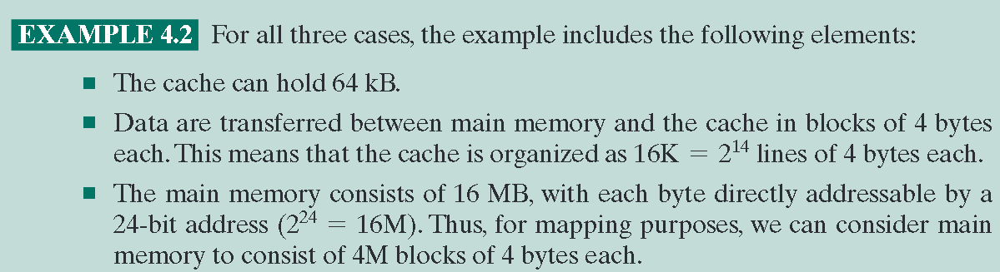

#### direct mapping

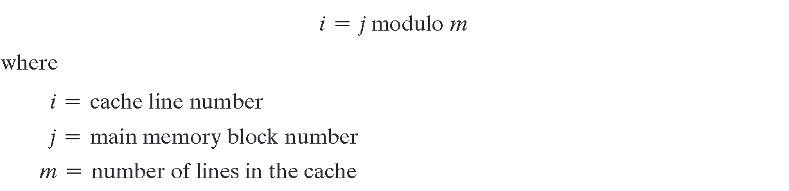

<a href="zotero://open-pdf/library/items/5WXAJZDU?page=163">“The direct mapping technique is simple and inexpensive to implement. Its main disadvantage is that there is a fixed cache location for any given block. Thus, if a program happens to reference words repeatedly from two different blocks that map into the same line, then the blocks will be continually swapped in the cache, and the hit ratio will be low (a phenomenon known as thrashing).”</a> （颠簸现象）

解决办法之一是

<a href="zotero://open-pdf/library/items/5WXAJZDU?page=163">“. Victim cache was originally proposed as an approach to reduce the conflict misses of direct mapped caches without affecting its fast access time. Victim cache is a fully associative cache, whose size is typically 4 to 16 cache lines, residing between a direct mapped L1 cache and the next level of memory.”</a>

#### associative mapping

地址直接被分为tag和word域，这样每个block都能进入任一line。缺点就是，当想要知道一个block是否在cache中时，必须遍历一遍所有line，比较tag（对比direct mapping，只需要在唯一的一个line那里比较tag即可）

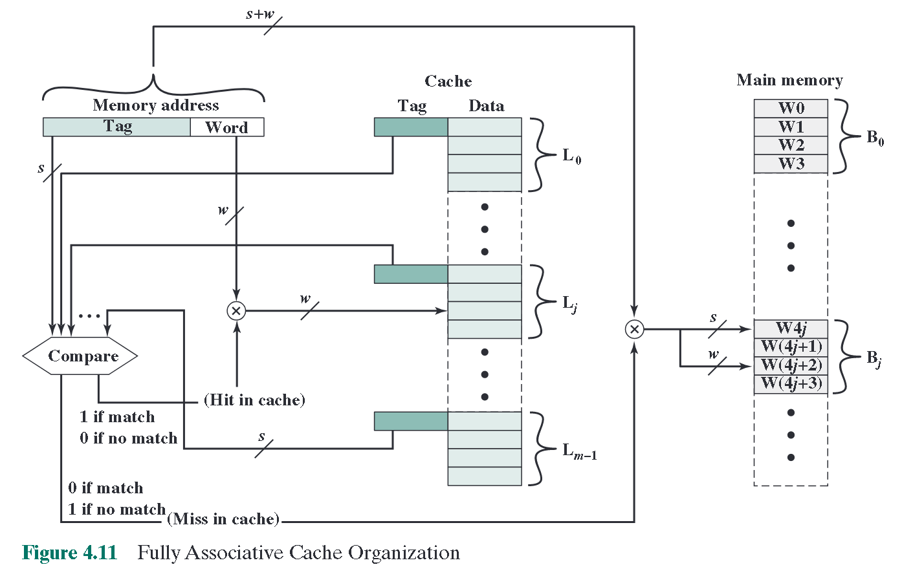

通过地址写tag域的bin转hex时，要注意tag只有22位，要在高位补零，从低位开始4个4个切分

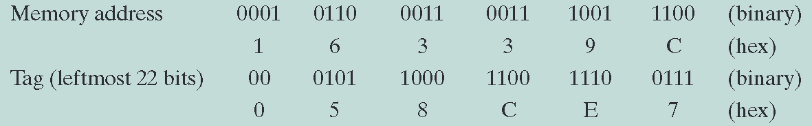

<a href="zotero://open-pdf/library/items/5WXAJZDU?page=165&#x26;annotation=U6FDPFZ3">“The principal disadvantage of associative mapping is the complex circuitry required to examine the tags of all cache lines in parallel.”</a>

当有新的block要进入一个已经满了的cache时，需要决定替换哪一个line，由此产生了替换算法的需求。(direct mapping就不用，因为哪个block到哪个line都是规定好的)

#### set-associative mapping

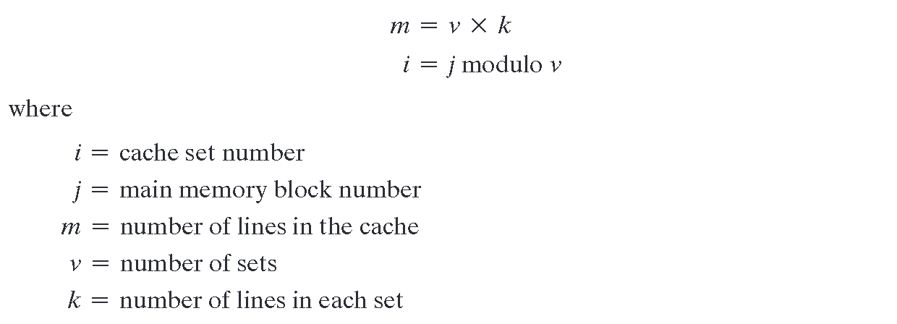

<a href="zotero://open-pdf/library/items/5WXAJZDU?page=165">“This is referred to as k-way set-associative mapping.”</a> way是表征一个组里面有几个line的数

<a href="zotero://open-pdf/library/items/5WXAJZDU?page=165">“With set-associative mapping, block Bj can be mapped into any of the lines of set j.”</a>

有v个组，每组里面k个line。可以把整个cache看成\*\*k个(而不是v个！因为set number是取模得到而不是任意得到的)\*\*直接映射cache，每一个直接映射缓存叫做一个way，每个way包含v个line

<a href="zotero://open-pdf/library/items/5WXAJZDU?page=165">“The first v lines of main memory are direct mapped into the v lines of each way; the next group of v lines of main memory are similarly mapped, and so on.”</a>

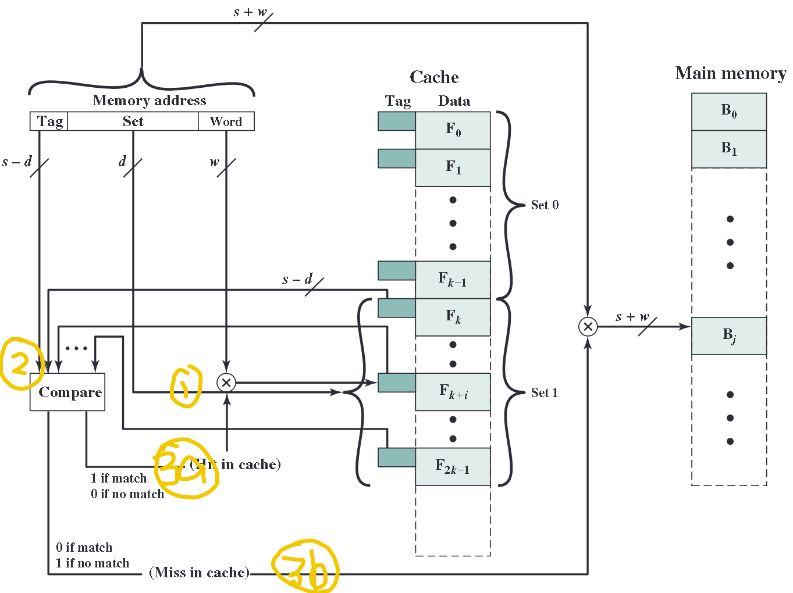

<a href="zotero://open-pdf/library/items/5WXAJZDU?page=169&#x26;annotation=UV5VPKHT">“In the extreme case of v = m, k = 1, the set-associative technique reduces to direct mapping, and for v = 1, k = m, it reduces to associative mapping.”</a>

### replacement algorithm

most popular: <a href="zotero://open-pdf/library/items/5WXAJZDU?page=170&#x26;annotation=ZCXHX48M">“least recently used (LRU): Replace that block in the set that has been in the cache longest with no reference to it.”</a>

<a href="zotero://open-pdf/library/items/5WXAJZDU?page=170">“first-in-first-out (FIFO): Replace that block in the set that has been in the cache longest.”</a>

<a href="zotero://open-pdf/library/items/5WXAJZDU?page=170">“least frequently used (LFU): Replace that block in the set that has experienced the fewest references. LFU could be implemented by associating a counter with each line.”</a>

<a href="zotero://open-pdf/library/items/5WXAJZDU?page=170">“pick a line at random from among the candidate lines.”</a>

### write policy

<a href="zotero://open-pdf/library/items/5WXAJZDU?page=170&#x26;annotation=4XQZZPDF">“If at least one write operation has been performed on a word in that line of the cache, then main memory must be updated by writing the line of cache out to the block of memory before bringing in the new block.”</a>

两个问题：1.不止一个设备有mm的读取权限，比如IO；2.多处理器多缓存

对策

<a href="zotero://open-pdf/library/items/5WXAJZDU?page=170&#x26;annotation=ILTU4ZYC">“The simplest technique is called write through. Using this technique, all write operations are made to main memory as well as to the cache, ensuring that main memory is always valid.”</a>

<a href="zotero://open-pdf/library/items/5WXAJZDU?page=170">“The main disadvantage of this technique is that it generates substantial memory traffic and may create a bottleneck.”</a>

值得注意的是，在多缓存条件下，如果一个缓存中的内容改变，不仅mm中的内容失效，其他缓存中(包含同样word的部分)也失效了，而且缓存的失效不能通过write through来避免

有三种方法来避免

<a href="zotero://open-pdf/library/items/5WXAJZDU?page=171">“Bus watching with write through”</a> 各个cache都有一个总线监视器，一旦发现自己这个cache中包含的内容在mm中被修改了，则将本cache中的内容设为失效

<a href="zotero://open-pdf/library/items/5WXAJZDU?page=171">“Hardware transparency”</a> 一个cache中修改内容，mm和所有包含同样内容的cache都修改更新

<a href="zotero://open-pdf/library/items/5WXAJZDU?page=171">“Noncacheable memory”</a> 不经过缓存，大家都直接读写内存

### line size

<a href="zotero://open-pdf/library/items/5WXAJZDU?page=172">“As the block size increases from very small to larger sizes, the hit ratio will at first increase because of the principle of locality, which states that data in the vicinity of a referenced word are likely to be referenced in the near future. As the block size increases, more useful data are brought into the cache. The hit ratio will begin to decrease, however, as the block becomes even bigger and the probability of using the newly fetched information becomes less than the probability of reusing the information that has to be replaced.”</a>

hit ratio下降的原因：1.块变大后，cache能容纳的块的数量下降，导致需要不停的覆写新块到cache。2.块变大后，块内数据的邻近性也在逐渐减弱

### number of caches

#### multilevel cache

片上cache带来了多级cache的可能

<a href="zotero://open-pdf/library/items/5WXAJZDU?page=172&#x26;annotation=57CCJY9W">“The simplest such organization is known as a two-level cache, with the internal level 1 (L1) and the external cache designated as level 2 (L2).”</a>

L2 chache有两个特征：与processor之间的连线是独占的，不用系统总线；2.L2 cache 有时候也变为片上cache了

L2 一般要L1的两倍大，这样带来的性能提升才比较明显

#### unified versus split caches

<a href="zotero://open-pdf/library/items/5WXAJZDU?page=174&#x26;annotation=7AVPVD2D">“More recently, it has become common to split the cache into two: one dedicated to instructions and one dedicated to data.”</a>

统一用途缓存有两点好处：1.（相比于分功能）自动提高命中率；2.实现方法简单

分功能缓存的好处：主要是对流水线操作友好

<a href="zotero://open-pdf/library/items/5WXAJZDU?page=174&#x26;annotation=AJU4TB2M">“The key advantage of the split cache design is that it eliminates contention for the cache between the instruction fetch/decode unit and the execution unit.”</a>

# Instruction sets: characteristics and functions

## <a href="zotero://open-pdf/library/items/5WXAJZDU?page=437">“Machine Instruction Characteristics”</a>

<a href="zotero://open-pdf/library/items/5WXAJZDU?page=438&#x26;annotation=HIMHK3TI">“The operation of the processor is determined by the instructions it executes, referred to as machine instructions or computer instructions. The collection of different instructions that the processor can execute is referred to as the processor’s instruction set.”</a>

一个指令包含的四要素：opcode,operand source,result operand ref,next instrucion ref

一般下一条指令的引用是隐含的，除非跳转。

源和目的地操作数地址可以来自于：

mm或虚拟内存

处理器reg

immediate立即数

IO设备

一般操作数都是二进制数，不方便使用，所以我们用文字缩写

<a href="zotero://open-pdf/library/items/5WXAJZDU?page=440">“Opcodes are represented by abbreviations, called mnemonics, that indicate the operation.”</a>

高级语言与低级语言的区别

<a href="zotero://open-pdf/library/items/5WXAJZDU?page=441&#x26;annotation=CRHPXEWE">“A high-level language expresses operations in a concise algebraic form, using variables. A machine language expresses operations in a basic form involving the movement of data to or from registers.”</a>

指令可以分为四类

“With this in mind we can categorize instruction types as follows:

■ Data processing: Arithmetic and logic instructions.

■ Data storage: Movement of data into or out of register and or memory locations.

■ Data movement: I/O instructions.

■ Control: Test and branch instructions.”

或者也可以分为arithmetic-logic,memory-IO,test-branch等等

### number of addresses

一般指令有3到0个地址，零地址指令需要用到stack。地址数的权衡：

处理器复杂度；指令长度；程序长度与总执行时间；全寄存器操作；

“The number of addresses per instruction is a basic design decision. Fewer addresses per instruction result in instructions that are more primitive, requiring a less complex processor. It also results in instructions of shorter length. On the other hand, programs contain more total instructions, which in general results in longer execution times and longer, more complex programs. Also, there is an important threshold between one-address and multiple-address instructions. With one-address instructions, the programmer generally has available only one general-purpose register, the accumulator. With multiple-address instructions, it is common to have multiple general-purpose registers. This allows some operations to be performed solely on registers. Because register references are faster than memory references, this speeds up execution. For reasons of flexibility and ability to use multiple registers, most contemporary machines employ a mixture of two- and three-address instructions.”

### Instruction set design

指令集设计的主要因素

Operation repertoire: How many and which operations to provide, and how complex operations should be.

Data types: The various types of data upon which operations are performed.

Instruction format: Instruction length (in bits), number of addresses, size of various fields, and so on.

Registers: Number of processor registers that can be referenced by instructions, and their use.

Addressing: The mode or modes by which the address of an operand is specified.

## Types of operands

最主要的四种数据：地址，数字，字符，逻辑数。地址可以被看成无符号整数

### numbers

packed decimal:四位二进制数表示一个十进制数，246 = 0000 0010 0100 0110.虽然浪费比特但是省去了进制转换

### characters

一般用IRA标准，又叫ASCII，能表示远多于可打印字符数的符号，于是多出来的用于控制打印、通信流程。一般用8位传输，所以最高位还可以用来奇偶校验

### Logical data

一般我们把一个n位的数据看成一个整体，但是有时候把它看成n个单比特数据也有一些好处：

1.存boolean变量时更加高效；2.有时候我们想按位操作一些数据，比如从ASCII码中提取BCD码

## Types of operation

opcode分类：

“■ Data transfer

■ Arithmetic

■ Logical

■ Conversion

■ I/O

■ System control

■ Transfer of control”

### Data transfer

数据传输指令必须指定几件事情：\
源操作数和目的操作数的地址\
传输的数据长度\
寻址方式

🔤如果一个或两个操作数都在内存中，那么处理器必须执行以下部分或全部操作：1 .计算内存地址，基于(在第13章中进行了讨论)的地址模式。2 .如果地址指的是虚拟内存，则从虚拟内存地址转换为实在内存地址。3 .判断被寻址项是否在缓存中。4 .如果不是，则向存储模块发出命令。🔤

### Arithmetic

一般对有符号(定点)数会提供基本的算数操作指令，有些还会为浮点数以及压缩BCD码提供

### Logical

按位操作

logical shift在移入处补零，移出处丢掉

arithmetic shift扩展符号位(右移)或者保留符号位(左移)

### transfer of control

为什么需要这类指令？因为程序经常会遇到循环、条件转移、分解任务(模块化编程)，这些都需要指令的跳转。

<a href="zotero://open-pdf/library/items/5WXAJZDU?page=458&#x26;annotation=YAZNXE4T">“most common transfer-of-control operations found in instruction sets: branch, skip, and procedure call.”</a>

procedure call的三个特点：1 .一个过程可以从多个位置调用。2 .一个过程调用可以出现在一个过程中。这使得程序的嵌套可以达到任意的深度。3 .每个过程调用由被调用程序中的一个返回进行匹配

常用的存储返回地址的地方有3个：■寄存器■调用过程的开始■栈顶

# Instruction sets: addressing modes and formats

## Addressing modes

<a href="zotero://open-pdf/library/items/5WXAJZDU?page=482">“the most common addressing techniques, or modes: ■ Immediate ■ Direct ■ Indirect ■ Register ■ Register indirect ■ Displacement ■ Stack”</a> 共有7种

计算机怎么知道用的是哪种寻址方式？要么在opcodes中，要么在指令中添加mode field

有效地址EA：对于无虚拟内存的系统来说，要么是存储器地址，要么是一个寄存器；在有虚拟地址的系统中，EA是虚拟地址或寄存器，实际映射到物理地址的工作是由内存馆里单元MMU实现的。

### Immediate addressing

oprand = A

优点：取数时没有内存引用，更快速

缺点：操作数的范围受限于address field

### Direct addressing

EA = A

需要一次内存引用，寻址空间受限

### Indirect addressing

解决寻址空间不够的问题：

<a href="zotero://open-pdf/library/items/5WXAJZDU?page=484">“One solution is to have the address field refer to the address of a word in memory, which in turn contains a full-length address of the operand.”</a>

EA = (A)

可用于寻址的位数从address field 的长度扩展到字长(后者一般大于前者)。主要缺点在于现在需要两次内存引用。这种方法可以多层嵌套但不常用

### Register addressing

EA = R

优点是：1.因为寄存器不多，所以用于寄存器寻址的bit少，指令变短；2.不涉及内存引用，更快

缺点在于寻址空间极其小

### Register indirect addressing

EA = (R)

优缺点和间接寻址一样，但是少了一次内存引用（第一次是从reg里面得到的）

### Displacement addressing

EA =A + （R）

#### relative addressing

PC-relative addressing,隐式使用PC内的值，即下一个指令的地址，加到本指令的address field中产生EA。

#### base-register addressing

一个reg中存着一个主存地址，本指令的address field加到上面产生EA

#### indexing（变址寻址）

指令的address field包含mm地址，被用到的reg包含偏移量，加到address field上产生EA（与上一条正好相反）

非常适合用于迭代操作

EA = A + (R)

(R) = (R) + 1

有时候，间接寻址和变址寻址会结合起来使用，有两种结合方法：前索引和后索引

后索引：先间接寻址，再变址寻址EA = (A) +(R).address field中的内容先拿到mm中取出其内容，再拿来跟R中的内容相加，结果作为EA

前索引：EA=(A+(R))先把R中的内容拿来加到地址域上，再拿到mm中取内容，把取来的内容作为EA

### Stack addressing

<a href="zotero://open-pdf/library/items/5WXAJZDU?page=488">“The stack is a reserved block of locations. Items are appended to the top of the stack so that, at any given time, the block is partially filled”</a> (<a href="zotero://select/library/items/VEKBRPPP">“Computer Organization and Architecture Designing for Performance.pdf”, p. 463</a>)

<a href="zotero://open-pdf/library/items/5WXAJZDU?page=488">“The stack pointer is maintained in a register. Thus, references to stack locations in memory <strong>are in fact register indirect addresses</strong>.”</a>

## Instruction formats

<a href="zotero://open-pdf/library/items/5WXAJZDU?page=494">“The most basic design issue to be faced is the instruction format length.This decision affects, and is affected by, memory size, memory organization, bus structure, processor complexity, and processor speed.”</a>

### instr. length

长的指令对程序员更友好，但是可能造成浪费；

指令长度应该和内存转移长度(一般就是总线宽度)相当或成倍数。实际上，内存传输速度已经成为瓶颈，解决办法之一是使用缓存，另一个办法就是使用更短的指令，指令越短，取指速度越快

指令长度还应该是字符长度的整数倍，并与定点数的长度（一般就是“word”的长度）相同

### Allocation of bits

给定指令长度，则操作码的数量(影响了操作码的位数)和寻址空间(影响了地址域的位数)之间就存在权衡。

一个改善方法是，用长度可变的opcodes

对于地址域来说，这些因素瓜分了分配给地址域的bit

寻址方式：不是所有寻址方式都可以隐式表达。这就占用了一些bit

操作数数量：每个操作数都需要有自己的寻址方式

寄存器数量：寄存器寻址用到的bit比主存寻址少多了，但是还是跟reg数量有馆！！！

寄存器组的数量：现代架构中，寄存器可能会根据功能分组，比如用于存地址和存数据的reg分开，这样在引用数据时就可以减少一些bit的使用

寻址范围

寻址粒度：比如按字节寻址还是按双字寻址，前者需要的地址位更多

# Processor structure and function

## processor organization

处理器必须要完成的任务：

取指、译码、取数、算数、写数

## Register organization

一般寄存器分为用户可见寄存器以及控制与状态寄存器

### User visible registers

一般可以分为4类：通用，数据，地址，控制码(flag)类

地址寄存器有以下几种常见的：段指针reg，变址reg，栈reg

寄存器设计的因素：

用通用寄存器好还是专用寄存器好：没有定论。在指令集的设计上来说，专用reg可以省bit，通用reg更加灵活

寄存器数量：这再次影响到指令集设计。比如32个寄存器需要5位specifier bits。一般来说，8-32个最优，不过目前也有上百个的

寄存器位长：至少要能表示出内存中最大的地址（不然寄存器寻址失效），也要能容纳绝大部分的数据类型。可以两个连着的reg合起来表示一个超长数据

地址码(flags)寄存器对用户部分可见：一般可以隐式的引用/使用它，但是用户不能修改(这类寄存器放在user -visible类里面而不放在control and status reg里面)

### Control and status registers

“Four registers are essential to instruction execution:

■ Program counter (PC): Contains the address of an instruction to be fetched.

■ Instruction register (IR): Contains the instruction most recently fetched.

■ Memory address register (MAR): Contains the address of a location in memory.

■ Memory buffer register (MBR): Contains a word of data to be written to memory or the word most recently read.”

控制和状态寄存器的设计因素：

1.系统支持：看系统要不要这个功能

2.控制信息在寄存器和存储器之间的分配，这也是一种速度和成本的权衡

## Instruction Cycle

一个指令周期包含三部分：取指，执指，中断

首先有一个The Indirect Cycle的概念。如果有间接寻址发生的话，间接取数也要算一个cycle

### 数据流

#### fetch cycle

PC包含下一条要取的指令的地址

该地址放到MAR memory address reg

再放到地址总线上

控制单元发出一个读内存请求

请求的结果放到数据总线上

再放入MBR

再放入IR

PC加1，准备进行下一轮取指

#### indirect cycle

如果取指后控制单元发现IR中的指令有用间接寻址的操作数，则产生indirect cycle：

MBR右端N个bit（包含地址的引用）传到MAR，再放到AB上，控制单元把读内存请求放到CB上，得到的地址放到**DB**上，再给到MBR。

## Instruction pipelining

<a href="zotero://open-pdf/library/items/5WXAJZDU?page=525&#x26;annotation=IT8ISR2F">“By laying the production process out in an assembly line, products at various stages can be worked on simultaneously. This process is also referred to as pipelining”</a>

The first stage fetches an instruction and buffers it. When the second stage is free, the first stage passes it the buffered instruction. While the second stage is executing the instruction, the first stage takes advantage of any unused memory cycles to fetch and buffer the next instruction. This is called instruction prefetch or fetch overlap.

流水线需要寄存器

二分流水线不能使效率翻倍的原因：

执行时间通常要比取指时间长，所以取指结束后很可能要等待执指结束

条件转移指令让下一条要执行的指令变得未知

更细致的划分流水线：

“■ Fetch instruction (FI): Read the next expected instruction into a buffer.

■ Decode instruction (DI): Determine the opcode and the operand specifiers.

■ Calculate operands (CO): Calculate the effective address of each source operand. This may involve displacement, register indirect, indirect, or other forms of address calculation.

■ Fetch operands (FO): Fetch each operand from memory. Operands in registers need not be fetched.

■ Execute instruction (EI): Perform the indicated operation and store the result, if any, in the specified destination operand location.

■ Write operand (WO): Store the result in memory.”

需要注意的是，不是所有指令都包含这六步，比如LOAD；也不是所有步骤都可以并行执行，比如不同步骤之间可能有内存冲突，如FI与FO，WO。不过，要取的数也有可能在缓存中，也有可能并不出现并行的FI,FO,WO，所以内存冲突大部分情况下不会放慢流水线

限制流水线性能的因素

不同步骤可能不是等时长的，会产生等待

条件跳转指令，会使得某些预取指失效

中断事件的存在，效果同上

还有一些问题，比如上一条指令本来要修改一个数，修改完后再用于后续计算，但是后续计算的指令再前面改数指令结束前就把数取走了，这造成的数据的失效

需要注意的是，流水线有两种画法，一种是每行表示一个指令，一种是每行表示一个slot

流水线也不是越多步越好。原因是

每一步都会造成额外的开销，把数据从一个buffer放到另一个buffer。这在逻辑上不独立的顺序指令中影响尤为严重，比如大量分支语句，或者内存访问具有依赖性的情况。

步骤越多，用来控制内存与寄存器访问依赖性的逻辑单元越复杂，有时候甚至会导致控制逻辑本身比要执行的逻辑还复杂

锁存器也是有延时的，每一个步骤的buffer需要时间来运行，因此也不能无限细分stage

### Pipeline performance

在假设没有分支语句的情况下，n条指令，每条指令k个stage，则总用时为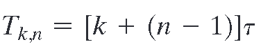

使用流水线带来的加速因子为“不使用流水线的用时/使用流水线的用时”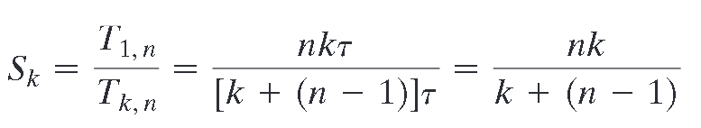

<a href="zotero://open-pdf/library/items/5WXAJZDU?page=531&#x26;annotation=2RVB76PJ">“As might be expected, at the limit (n→∞), we have a k-fold speedup.”</a>

### Pipeline hazards

类似竞争与冒险

<a href="zotero://open-pdf/library/items/5WXAJZDU?page=532&#x26;annotation=UEWKR3CB">“A pipeline hazard occurs when the pipeline, or some portion of the pipeline, must stall because conditions do not permit continued execution. Such a pipeline stall is also referred to as a pipeline bubble.”</a>

有三种冒险

<a href="zotero://open-pdf/library/items/5WXAJZDU?page=532&#x26;annotation=ZQF7TH3H">“<strong>resource hazards</strong> A resource hazard occurs when two (or more) instructions that are already in the pipeline need the same resource.”</a>

比如处理器对于内存只有一个接口，那么取指，取数和写数就不可能同时进行；又比如已经取来了多个指令，但是由于执指耗时长，所以ALU可能正忙，也得等待。解决办法就是增加处理器资源，比如接口和ALU

<a href="zotero://open-pdf/library/items/5WXAJZDU?page=533&#x26;annotation=FUSYZ9RA">“<strong>data hazards</strong> A data hazard occurs when there is a conflict in the access of an operand location.”</a> 发生在前后指令用到同一个数据的情况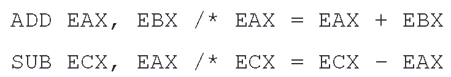

如果在ADD指令的WO还没结束(EAX未更新)的情况下就执行SUB，就会产生错误结果，因此，SUB的FO指令必须等ADD指令的WO结束才能进行，造成效率下降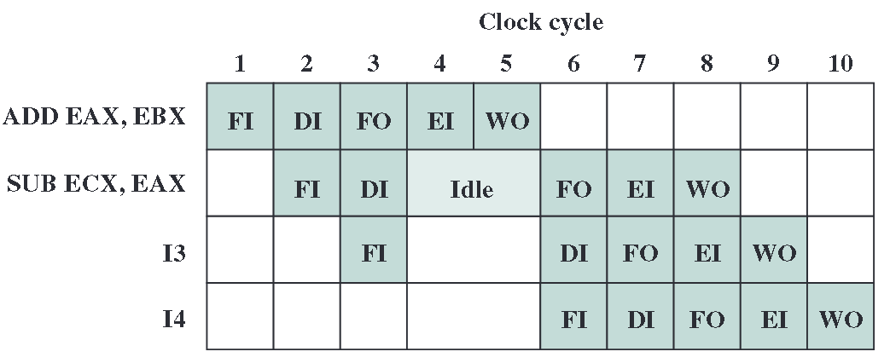

数据冒险有三种：

“■ Read after write (RAW), or true dependency: An instruction modifies a register or memory location and a succeeding instruction reads the data in that memory or register location. A hazard occurs if the read takes place before the write operation is complete.

■ Write after read (WAR), or antidependency: An instruction reads a register or memory location and a succeeding instruction writes to the location. A hazard occurs if the write operation completes before the read operation takes place.

■ Write after write (WAW), or output dependency: Two instructions both write to the same location. A hazard occurs if the write operations take place in the reverse order of the intended sequence.”

<a href="zotero://open-pdf/library/items/5WXAJZDU?page=534&#x26;annotation=JAUGL3PV">“<strong>control hazards</strong> A control hazard, also known as a branch hazard, occurs when the pipeline makes the wrong decision on a branch prediction and therefore brings instructions into the pipeline that must subsequently be discarded.”</a>

### Dealing with branches

control hazards就是分支冒险，太重要了以至于单独拿一个小节来说

“A variety of approaches have been taken for dealing with conditional branches:

■ Multiple streams

■ Prefetch branch target

■ Loop buffer

■ Branch prediction

■ Delayed branch”

**Multiple streams** 简单粗暴，对于分支指令，直接把两个可能的情况入口全部加载到流水线上处理，这需要额外的硬件开销。问题是，两个流之间可能会出现内存/寄存器访问冲突；以及分支套分支导致开出很多流，占用硬件资源。

**Prefetch branch target** 把分支语句涉及到的inline语句(即后面紧跟的)和target语句(即要跳转到的)以及两者的后续语句取到cache中(注意，不是取到流水线中)，这样不管分支跳到哪里，都可以省去访问内存取指的步骤

**Loop buffer** 存着最近取来的n条指令。在知道要跳转到哪条分支后，先检查这个buffer里面有没有那条指令，如果有直接拿来用，不用经过读内存，更快。这种办法不是基于预测的，它是在知道要跳到那里的基础上来优化的。不是快在把流水线填满，而是快在取指更快。

优点：

结合预取技术，loop buffer里面会有本指令之后的**数条**指令，这比单纯的预取还要快。

如果分支语句的两个入口离得很近，则两个入口都会在buffer里面，这种情况在if条件句里很常见

这种策略很适合循环指令（这也是名字的来由），如果一个循环里的所有指令都在buffer里面，那整个循环中只需要在循环初访问一次内存取指，以后都在寄存器内取指

loop buffer有点像cache，但是比cache小，因为只存几条按顺序摆放的指令

**Branch prediction**

常见的预测策略

静态

“■ Predict never taken

■ Predict always taken

■ Predict by opcode

动态

■ Taken/not taken switch

■ Branch history table”

动态预测策略需要维护一些比特，这些比特不在内存中，而在一些临时存储器中，比如cache或者一个小表格中

如果用一个bit，那么在进循环和出循环的时候各误判一次；如果用两个比特，只有连续两次判断出错才会更换判定偏好

<a href="zotero://open-pdf/library/items/5WXAJZDU?page=538">“the algorithm requires two consecutive wrong predictions to change the prediction decision”</a>

用历史bit的缺点在于，如果要选择跳转，跳转的地址也只有在目标地址被解码后才能知道，而不能预测决定完成的瞬间就把目标指令取来。为此，可以维护一个分支历史表，表中的每个项由三个元素组成：分支指令的地址、记录该指令使用状态的若干历史位以及关于目标指令的信息（一般是目标指令的地址）

将分支历史表作为缓存处理。每个预取触发分支历史表中的查找。如果没有找到匹配，则使用下一个顺序地址进行取指。如果找到匹配，则根据指令的状态进行预测：将下一个顺序地址或分支目标地址反馈给选择逻辑。

branch target buffer 与 branch history table 的区别

branch target buffer(BTB) 存储分支的目标地址，用于加速目标指令的获取；而分支历史表存储分支的历史行为，用于辅助分支预测器做出更准确的预测。两者通常结合使用，以提高分支预测的准确性和处理器的整体性能。

\*\*Delayed branch \*\*将分支语句延迟，比如一个分支语句和后面的普通操作语句没有逻辑关系，那就可以先执行后面的普通语句。

第15章 RISC

最主要的特征：

多通用寄存器

简单指令集

指令流水线优化

高级语言的特征：（？）

<a href="zotero://open-pdf/library/items/5WXAJZDU?page=562">“These high-level languages (HLLs): (1) allow the programmer to express algorithms more concisely; (2) allow the compiler to take care of details that are not important in the programmer’s expression of algorithms; and (3) often support naturally the use of structured programming and/or object-oriented design.”</a>

sematic gap:

<a href="zotero://open-pdf/library/items/5WXAJZDU?page=562">“the difference between the operations provided in HLLs and those provided in computer architecture.”</a>

the reasoning behind RISC 可以从下面几个方面展开

“The aspects of computation of interest are as follows:

■ Operations performed: These determine the functions to be performed by the processor and its interaction with memory.

<a href="zotero://open-pdf/library/items/5WXAJZDU?page=564">“The results suggest that the procedure call/return is the most time-consuming operation in typical HLL programs.”</a>

<a href="zotero://open-pdf/library/items/5WXAJZDU?page=566&#x26;annotation=HGPBGBYV">“They found that it is rare to have a long uninterrupted sequence of procedure calls followed by the corresponding sequence of returns. Rather, they found that a program remains confined to a rather narrow window of procedure-invocation depth.”</a>

■ Operands used: The types of operands and the frequency of their use determine the memory organization for storing them and the addressing modes for accessing them.

<a href="zotero://open-pdf/library/items/5WXAJZDU?page=565&#x26;annotation=Z638GDFV">“Thus, there is a preponderance of references to scalars, and these are highly localized.”</a>

■ Execution sequencing: This determines the control and pipeline organization.”

<a href="zotero://open-pdf/library/items/5WXAJZDU?page=567">“Generalizing from the work of a number of researchers, three elements emerge that, by and large, characterize RISC architectures.”</a> 从许多研究人员的工作中总结出来，大体上有三个元素是RISC体系结构的特征。

<a href="zotero://open-pdf/library/items/5WXAJZDU?page=567">“First, use a large number of registers or use a compiler to optimize register usage.”</a>

<a href="zotero://open-pdf/library/items/5WXAJZDU?page=567">“Second, careful attention needs to be paid to the design of instruction pipelines.”</a>

<a href="zotero://open-pdf/library/items/5WXAJZDU?page=567">“Finally, an instruction set consisting of high-performance primitives is indicated.”</a>

15.2 THE USE OF A LARGE REGISTER FILE

硬件和软件都可以实现：

<a href="zotero://open-pdf/library/items/5WXAJZDU?page=567&#x26;annotation=EMY2Q2NH">“The software approach is to rely on the compiler to maximize register usage. The compiler will attempt to assign registers to those variables that will be used the most in a given time period.”</a>

<a href="zotero://open-pdf/library/items/5WXAJZDU?page=567&#x26;annotation=28VX29YN">“The hardware approach is simply to use more registers so that more variables can be held in registers for longer periods of time.”</a>

寄存器窗口

基于两个事实：

<a href="zotero://open-pdf/library/items/5WXAJZDU?page=568&#x26;annotation=A4NQJ5LG">“The solution is based on two other results reported in Section 15.1. First, a typical procedure employs only a few passed parameters and local variables (Table 15.4). Second, the depth of procedure activation fluctuates within a relatively narrow range (Figure 4.21).”</a>

<a href="zotero://open-pdf/library/items/5WXAJZDU?page=569&#x26;annotation=6SLFXUXC">“the actual organization of the register file is as a circular buffer of overlapping windows.”</a>

全局变量

可以存在内存中，也可以存在专用的全局变量寄存器中

大型寄存器还是cache？

<a href="zotero://open-pdf/library/items/5WXAJZDU?page=570&#x26;annotation=BEEGCIY4">“The register file should save time, because all local scalar variables are retained. On the other hand, the cache may make more efficient use of space, because it is reacting to the situation dynamically. Furthermore, caches generally treat all memory references alike, including instructions and other types of data. Thus, savings in these other areas are possible with a cache and not a register file.”</a> (<a href="zotero://select/library/items/VEKBRPPP">“Computer Organization and Architecture Designing for Performance.pdf”, p. 545</a>) 🔤寄存器文件应该节省时间，因为保留了所有的局部标量变量。另一方面，缓存可能会更有效地利用空间，因为它是动态地对情况作出反应。此外，缓存一般对所有内存引用都一视同仁，包括指令和其他类型的数据。因此，在这些其他领域的节省可以通过缓存而不是寄存器文件来实现。🔤

<a href="zotero://open-pdf/library/items/5WXAJZDU?page=571&#x26;annotation=YGIWJ93G">“A register file may make inefficient use of space, because not all procedures will need the full window space allotted to them. On the other hand, the cache suffers from another sort of inefficiency: Data are read into the cache in blocks. Whereas the register file contains only those variables in use, the cache reads in a block of data, some or much of which will not be used.”</a> (<a href="zotero://select/library/items/VEKBRPPP">“Computer Organization and Architecture Designing for Performance.pdf”, p. 546</a>) 🔤一个寄存器文件可能会造成空间的低效利用，因为并不是所有的程序都需要分配给它们完整的窗口空间。另一方面，缓存存在另一种效率低下的问题：数据以块的形式读入缓存。而寄存器文件只包含那些正在使用的变量，缓存读取的是一块数据，其中一部分或大部分不会被使用。🔤

<a href="zotero://open-pdf/library/items/5WXAJZDU?page=571&#x26;annotation=BJVCKKJF">“There is one characteristic, however, in which the register approach is clearly superior and which suggests that a cache-based system will be noticeably slower. This distinction shows up in the amount of addressing overhead experienced by the two approaches.”</a> (<a href="zotero://select/library/items/VEKBRPPP">“Computer Organization and Architecture Designing for Performance.pdf”, p. 546</a>) 🔤然而，有一个特点，其中寄存器方法显然更优越，这表明基于缓存的系统将明显更慢。这种区别体现在两种方法所经历的寻址开销的大小上。🔤

RISC的基本特征

“■ One instruction per cycle

■ Register-to-register operations

■ Simple addressing modes

■ Simple instruction formats”

# Chapter 20 Control Unit Operation

<a href="zotero://open-pdf/library/items/5WXAJZDU?page=733&#x26;annotation=R6PBJLJY">“the following list of those things needed to specify the function of a processor emerges:”</a> (<a href="zotero://select/library/items/VEKBRPPP">“Computer Organization and Architecture Designing for Performance.pdf”, p. 708</a>) 🔤下面列出了指定处理器功能所需的东西：🔤

“1. Operations (opcodes)

2\. Addressing modes

3\. Registers

4\. I/O module interface

5\. Memory module interface

6\. Interrupts”

## Micro-Operations

<a href="zotero://open-pdf/library/items/5WXAJZDU?page=734&#x26;annotation=7XIEV5XJ">“In fact, we will see that each of the smaller cycles involves a series of steps, each of which involves the processor registers. We will refer to these steps as micro-operations.”</a>

是在取指，间址，执指，中断再下一层的微操作

划分层次：程序--指令--子周期--微操作。接下来就按照子周期的顺序来讲微操作

### Fetch Cycle

“Four registers are involved:

■ Memory address register (MAR): Is connected to the address lines of the system bus. It specifies the address in memory for a read or write operation.

■ Memory buffer register (MBR): Is connected to the data lines of the system bus. It contains the value to be stored in memory or the last value read from memory.”

“■ Program counter (PC): Holds the address of the next instruction to be fetched.

■ Instruction register (IR): Holds the last instruction fetched.”

从寄存器的角度来看取指阶段，可以分为三个阶段：

“■ First time unit: Move contents of PC to MAR.

■ Second time unit: Move contents of memory location specified by MAR to MBR. Increment by I the contents of the PC.

■ Third time unit: Move contents of MBR to IR.”

1.把下一条指令的地址从PC放到MAR

2.MAR把地址放到总线上，同时控制单元发出读指令，然后结果就出现在总线上并被复制到MBR。同时PC+1.这一步统称为“取来指令”

3.把指令内容从MBR放到IR

因为第二步的两步可以同时进行，所以PC+1也可以划入步骤3。微操作的划分遵循两个原则：

<a href="zotero://open-pdf/library/items/5WXAJZDU?page=736">“1. The proper sequence of events must be followed. Thus (MAR d (PC)) must precede (MBR d Memory) because the memory read operation makes use of the address in the MAR. 2. Conflicts must be avoided. One should not attempt to read to and write from the same register in one time unit”</a>

（值得注意的是，PC自增有时候用到ALU，可能会导致额外的微操作）

### Indirect Cycle

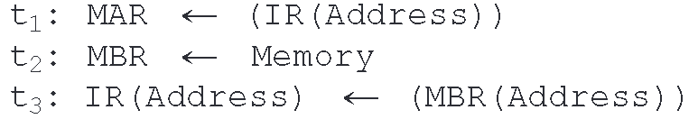

### The Interrupt Cycle

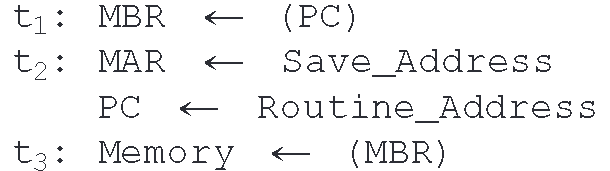

### The Execute Cycle

上述三个子周期都是简单和可预测的，其包含的微操作序列都是固定的。但执指阶段不是这样。

<a href="zotero://open-pdf/library/items/5WXAJZDU?page=737&#x26;annotation=YIQ22XKM">“The control unit examines the opcode and generates a sequence of micro-operations based on the value of the opcode. This is referred to as instruction decoding.”</a>  🔤控制单元对操作码进行检查，并根据操作码的值生成微操作序列。这被称为指令译码。🔤

然后书中给了几个例子：普通加法、条件指令、跳转指令，表明不同的执指由不同的微操作组成。

### The Instruction Cycle

指令周期是取指，执指等子周期的上一级概念。

<a href="zotero://open-pdf/library/items/5WXAJZDU?page=738&#x26;annotation=X8JCMILG">“instruction cycle code (ICC). The ICC designates the state of the processor in terms of which portion of the cycle it is in”</a>

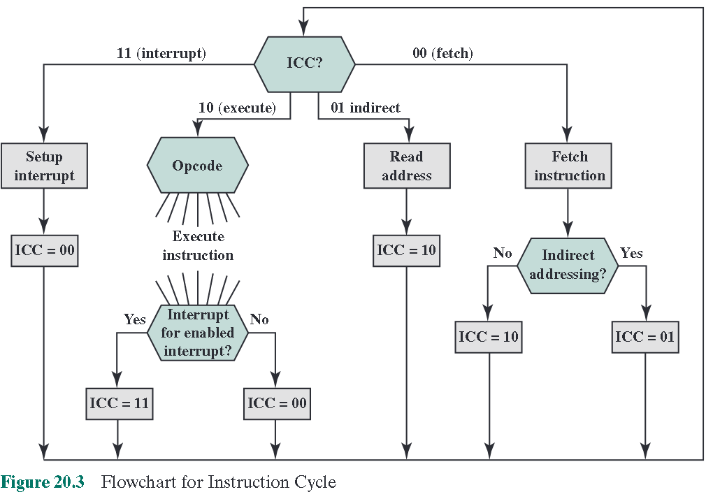

<a href="zotero://open-pdf/library/items/5WXAJZDU?page=739">“The indirect cycle is always followed by the execute cycle. The interrupt cycle is always followed by the fetch cycle (see Figure 14.4, The Instruction Cycle). For both the fetch and execute cycles, the next cycle depends on the state of the system.”</a>

## Control of Processor

“First, the basic functional elements of the processor are the following:

■ ALU

■ Registers

■ Internal data paths

■ External data paths

■ Control unit”

“all microoperations fall into one of the following categories:

■ Transfer data from one register to another.

■ Transfer data from a register to an external interface (e.g., system bus).

■ Transfer data from an external interface to a register.

■ Perform an arithmetic or logic operation, using registers for input and output.”

“The control unit performs two basic tasks:

■ Sequencing: The control unit causes the processor to step through a series of micro-operations in the proper sequence, based on the program being executed.

■ Execution: The control unit causes each micro-operation to be performed.”

### Control Signal

控制单元的输入有：

“■ Clock: This is how the control unit “keeps time.” The control unit causes one micro-operation (or a set of simultaneous micro-operations) to be performed for each clock pulse. This is sometimes referred to as the processor cycle time, or the clock cycle time.

■ Instruction register: The opcode and addressing mode of the current instruction are used to determine which micro-operations to perform during the execute cycle.

■ Flags: These are needed by the control unit to determine the status of the processor and the outcome of previous ALU operations. For example, for the increment-and-skip-if-zero (ISZ) instruction, the control unit will increment the PC if the zero flag is set.

■ Control signals from control bus: The control bus portion of the system bus provides signals to the control unit.”

控制单元的输出有：

“■ Control signals within the processor: These are two types: those that cause data to be moved from one register to another, and those that activate specific ALU functions.

■ Control signals to control bus: These are also of two types: control signals to memory, and control signals to the I/O modules.”

有三种信号被使用：

*   激活ALU的
*   激活数据链路的
*   用于外部总线或接口的\\

例子需要掌握

## Hardwired Implementation

上一节讲的是控制单元的输入输出和功能，这一节讲的是实现方法。大致分为两类：硬线连接的实现以及微编程的实现

# Chapter 21 Microprogrammed control

## Basic concepts

Many CISC processors implement a microprogrammed control unit.

<a href="zotero://open-pdf/library/items/5WXAJZDU?page=756">“each microoperation is described in symbolic notation. This notation looks suspiciously like a programming language. In fact it is a language, known as a microprogramming language. Each line describes a set of micro-operations occurring at one time and is known as a microinstruction. A sequence of instructions is known as a microprogram, or firmware.”</a> (固件)

<a href="zotero://open-pdf/library/items/5WXAJZDU?page=756&#x26;annotation=R9D6YSQM">“So we could construct a control word in which each bit represents one control line.”</a>

<a href="zotero://open-pdf/library/items/5WXAJZDU?page=757"><strong>“horizontal microinstruction”</strong></a>

<a href="zotero://open-pdf/library/items/5WXAJZDU?page=757">“1. To execute this microinstruction, turn on all the control lines indicated by a 1 bit; leave off all control lines indicated by a 0 bit. The resulting control signals will cause one or more micro-operations to be performed. 2. If the condition indicated by the condition bits is false, execute the next microinstruction in sequence. 3. If the condition indicated by the condition bits is true, the next microinstruction to be executed is indicated in the address field.”</a>

CAR: control address register

CBR: control buffer register
